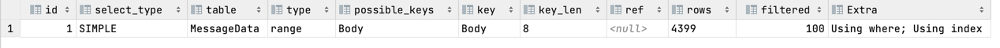

# How to run

1) Clone the repository with Git.
2) (Optional) Run `docker-compose --file docker-compose.dev.yml up -d` within the `db` directory to set up two databases. You can then connect to them on ports `3306` and `3307` to populate them with data.
3) (Optional) Create a new user with read-only permissions on each database:
    ```sql
    CREATE USER 'blob-ref-count' IDENTIFIED BY 'secret';
    GRANT SELECT ON *.* TO 'blob-ref-count';
    FLUSH PRIVILEGES;
    ```
4) Configure the databases and checked columns in `config/databases.json`.
5) Adjust the `RangeSize` in `config/checker.json`. It's set to `500` by default but it would be reasonable to increase it to e.g. a few millions when running on large tables.
6) Install [Node.js](https://nodejs.org/en/).
7) Run `npm install` in the project directory.
8) Run `npm run consistency-check` to perform the consistency checking process.

# Solution summary

- Time complexity: `O(blob_count)`. As `blob_count ~ 10⁹` anything above linear would have led to massive run durations.
- Space complexity: `O(1)`.
- No schema changes and no `TRIGGER`s. The consistency check can be run right away without any migration. While this wasn't a requirement of the exercise, it's still a nice-to-have.
- DB connections are all readonly.
- SQL queries never access tables (only indexes), which considerably reduces the I/O burden.
- SQL queries and consistency calculations can run on arbitrary slices of data without performance penalties (using only `WHERE` ranges on indexes). This enables us to do check ranges in as many parallel workers as we want.
- Designed with high parallelization in mind. An arbitrary number of checkers can be run in parallel, but unfortunately I didn't have the time to set up a concurrent pool of workers to demonstrate it.
- Free of [side effects](https://en.wikipedia.org/wiki/Side_effect_(computer_science)) and low DB memory footprint through the strict use of queries that don't cause MySQL to use [internal temporary tables](https://dev.mysql.com/doc/refman/5.7/en/internal-temporary-tables.html).
- No SQL locking reads (and no gap locks) as they would degrade write performances. All SQL queries use the [`READ COMMITTED`](https://dev.mysql.com/doc/refman/5.7/en/innodb-transaction-isolation-levels.html#isolevel_read-committed) or [`READ UNCOMMITTED`](https://dev.mysql.com/doc/refman/5.7/en/innodb-transaction-isolation-levels.html#isolevel_read-uncommitted) isolation levels for improved performances.
- Strict eventual correctness of consistency checks. i.e. no persistent state means that consistency checks can never get “stuck” with references that have actually been resolved since the last consistency check.
- Vertical sharding support. For example if in the future we split `ProtonGlobal` into two tables `ProtonBlobReferences` and `ProtonGlobal`, the consistency checks will still work properly. The `databases.json` configuration file will need to be modified accordingly to add the new databases and table names.
- Horizontal sharding support. Cutting ranges of table rows to put them into new shards (for performance/storage reasons) won't break the consistency checks. It will only require to add the new database shards to `databases.json`.

# Remarks

- I used raw MySQL queries instead of an ORM (the most popular PHP ORMs are Doctrine and Laravel Eloquent). The goal of this choice is to control the actual queries that are run, and optimize them. This is important as the consistency checker is designed to be highly performant.
- There are no integration or unit tests for now. I value greatly testing my code, but I could unfortunately not do it in the allotted time.
- Another caveat is that the queries all return the full results after they complete. In order to further reduce memory use and improve performances, they should be converted to process the results as streams. Modifying them to do that would be reasonably straightforward, but I didn't have the time to do these changes.
- We don't use prepared SQL queries, but the input is provided by us which makes SQL injections not a concern. Additionally, the `blob-ref-count` MySQL user that we use has readonly access to the databases.
- Several tables lack a `IS NOT NULL` constraint on `BlobStorageID`. For the exercise I assumed that it was deliberate and I did not log them. If logging them is wanted, an extra check can be easily added simply by running the following highly-efficient query on each table: `SELECT COUNT(*) FROM [table] WHERE BlobStorageId IS NULL`.

# Alternatives that were considered:

- Soft deletions/updates with a new `invalidated` boolean field. It would make consistency of checks easier to handle and incremental consistency checks possible (just start from the last ID).
  - This would require a schema migration, and backfilling the missing `BlobStorageID`s.
  - Soft deletions bloat the tables and indexes, which is not ideal in terms of long-term performances.
- Store the reference counts in a Redis hash and update them by streaming the MySQL binlogs (see [replication slave stream](https://dev.mysql.com/doc/refman/8.0/en/privileges-provided.html#priv_replication-slave)). Several libraries already provide APIs to consume the streams directly. See [mysql-binlog-connector-java](https://github.com/osheroff/mysql-binlog-connector-java) for an example.
  - Redis is particularly efficient with hash maps, which would lead to performant comparisons.
  - We could exclusively store deltas (`mysql_stored_ref_count - mysql_recounted_ref_count`). We could then fetch the deltas and any delta which is not equal to 0 means that there is a reference count mismatch. The binlog would allow to observe the reference counts in real-time which would be tremendously useful to gain a deeper insight on patterns of reference inconsistencies.

# Query performances

The queries that are used can all be found in the file `src/query/queryBuilder.mjs`.

The queries were very carefully designed to optimize their performance using advanced MySQL and InnoDB features:
- The queries don't trigger any table reads whatsoever, they only perform index reads. This is enabled by the strict use of [covering indexes](https://dev.mysql.com/doc/refman/5.7/en/glossary.html#glos_covering_index) on all the queries.
- All the queries use the [`READ COMMITTED`](https://dev.mysql.com/doc/refman/5.7/en/innodb-transaction-isolation-levels.html#isolevel_read-committed) or [`READ UNCOMMITTED`](https://dev.mysql.com/doc/refman/5.7/en/innodb-transaction-isolation-levels.html#isolevel_read-uncommitted) isolation levels. This prevents the hidden use of [snapshots](https://dev.mysql.com/doc/refman/5.7/en/glossary.html#glos_snapshot) by MySQL due to the default isolation type that it uses: [`REPEATABLE READ`](https://dev.mysql.com/doc/refman/5.7/en/innodb-transaction-isolation-levels.html#isolevel_repeatable-read).
- None of the queries trigger the hidden building of [internal temporary tables](https://dev.mysql.com/doc/refman/5.7/en/internal-temporary-tables.html) by MySQL. This ensures minimal performance impact on the databases, especially in terms of I/O.
- All the `WHERE`, `ORDER BY`, and `GROUP BY` clauses are performed on [B-Tree indexes](https://dev.mysql.com/doc/refman/5.7/en/index-btree-hash.html, which the best type of index for comparison clauses. Hash Indexes on the other hand would be very slow to apply comparison clauses.

## Balanced ID range building

In order to make efficient parallelization possible, the `BlobStorageID` key space needs to be divided in ranges with roughly the same number of rows in each. Since `BlobStorageID` is sparse (there are sometimes big “holes” between IDs), we can't determine ranges without doing a first pass.
The balanced rangers are achieved through an initial query that returns balanced ranges.

```sql
SET SESSION TRANSACTION ISOLATION LEVEL READ UNCOMMITTED;

SELECT 0 INTO @row;

SELECT @row := @row +1 AS rownum, BlobStorageID as BlobID
FROM ProtonMailGlobal.BlobStorage
HAVING (rownum-1) % ${rangeSize + 1} = 0
ORDER BY BlobStorageID;
```

Running an `EXPLAIN` on this query shows that it's indeed highly performant. There is a single step, which exclusively uses an index (not a single table read!).


**Explanations**:
- The first line sets the isolation level to [`READ UNCOMMITTED`](https://dev.mysql.com/doc/refman/5.7/en/innodb-transaction-isolation-levels.html#isolevel_read-uncommitted) (dirty reads). This improves the performances especially in the context of write-heavy databases. The downside is that the data that we read may change in live as we go through the rows. This isn't a problem in practice here as we only need to get intervals that are roughly balanced.
- The `@row` variable is used to count rows in real-time as we traverse the index. Note that it's carefully placed at the top-level `SELECT` rather than in a subquery (it would cause MySQL to secretly create a private materialized temporary table which ruins performances).
- The `HAVING` clause does a modulo on the current row number in order to only return the BlobStorageID of the `rangeSize`th row.
- Note that the use of a `HAVING` clause instead of a `WHERE` clause is deliberate. Since the condition is on the variable `rownum` (which is not an index), using a `WHERE` condition leads MySQL to create a temporary table to be able to filter the results. `HAVING` forces MySQL to do a post-filter after each row, which doesn't degrade the performances at all in this case (removing the `HAVING` clause doesn't reduce the number of rows that MySQL traverses).

Note that we can't rely on `LIMIT`/`OFFSET` for the ranges because they would incur [massive performance penalties](https://www.oreilly.com/library/view/high-performance-mysql/9780596101718/ch04.html#optimizing_limit_and_offset) (unwanted table rescans), and would additionally cause double-counting issues and missed counts (data races which change the rows that the offsets point to).


## Fetching the stored references

Fetching the stored references is also highly optimized. Like all the queries it's index-only reads, no MySQL hidden temporary table, etc. See the query below for how it's done:

```
SET SESSION TRANSACTION ISOLATION LEVEL READ COMMITTED;

SELECT BlobStorageID as BlobID, NumReferences as count
FROM ProtonMailGlobal.BlobStorage
WHERE ${minId} <= BlobStorageID AND BlobStorageID < ${maxId}
ORDER BY BlobStorageID;
```

Likewise, running an `EXPLAIN` on this query shows that it's highly performant.


**Explanations**:
- The `WHERE` is used to scope the query to a specific ID range (that was computed in the first query). The condition is on the primary index (B-tree), which ensure high performances and no temporary views.
- Likewise, the `ORDER BY` is on the primary index.
- There is no `GROUP BY` clause as the primary index has the `UNIQUE` and `NOT NULL` properties. There is no point in doing a `GROUP BY` as the values are already all distinct.
- This time we use the [`READ COMMITTED`](https://dev.mysql.com/doc/refman/5.7/en/innodb-transaction-isolation-levels.html#isolevel_read-committed) isolation level. The `UNCOMMITTED` level that we previously used wouldn't be appropriate here as we would potentially get data that has never been the state of the database, leading to false positive (consistency issues when there is actually none). It's still highly performant compared to the default MySQL isolastion mode.


## Recounting the references

In order to verify that the stored counts are correct, we recompute the counts from the ground up. See this query:

```sql
SET SESSION TRANSACTION ISOLATION LEVEL READ COMMITTED;

SELECT ${idField} as BlobID, COUNT(1) as count
FROM ${table} FORCE INDEX (${idField})
WHERE ${minId} <= ${idField} AND ${idField} < ${maxId}
GROUP BY ${idField}
ORDER BY ${idField}
```

The `EXPLAIN` shows high performances, which is in line with the two previous queries.


**Explanations**:
- Most of the performance tricks were already explored in the two previous queries so I won't expand on them.
- The `FORCE INDEX` clause makes sure that the MySQL optimizer heuristics don't trigger a full-table scan by mistake.
